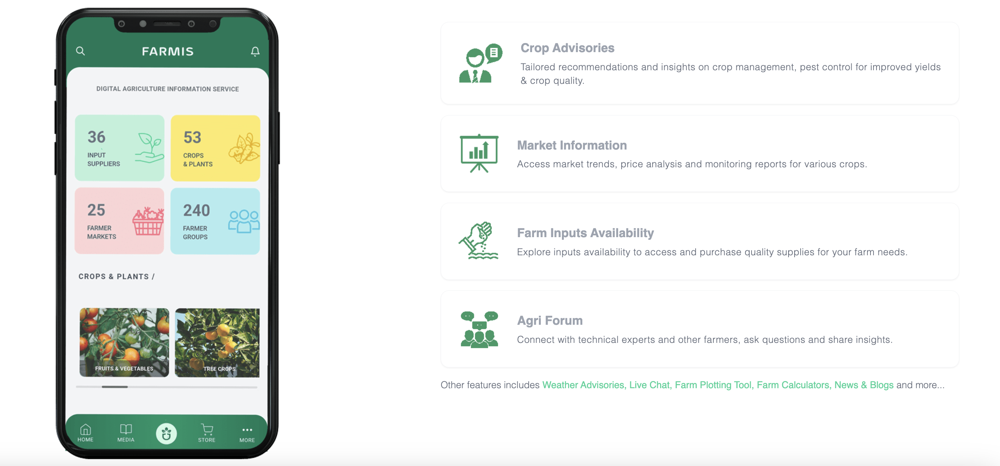

# About FARMIS

About FARMIS digital agriculture information service for Papua New Guinea

<figure markdown>
  {width="960" align=left }
  <figcaption>A screenshot of FARMIS App & main features</figcaption>
</figure>

## Overview

FARMIS is a comprehensive digital agriculture information services platform designed to provide farmers with access to real-time data and insights for optimized crop production and increased yield.

FARMIS recognizes the importance of agriculture in sustaining livelihoods, promoting food security, and ensuring environmental sustainability. This platform leverages the latest advances in digital technology, data analytics, and artificial intelligence to empower farmers with critical information and tools needed to improve their farming operations.

The mission of FARMIS is to provide accessible and reliable agricultural information to farmers, regardless of their location or level of education. With FARMIS, farmers can access information on weather patterns, soil conditions, pest and disease control, crop management practices, and market prices. Our platform also provides a marketplace for buying and selling agricultural inputs, such as seeds, fertilizers, and machinery.

FARMIS is committed to building a community of farmers and experts who can share knowledge and experiences to drive innovation and progress in agriculture. Our team of agronomists, data scientists, and engineers are dedicated to providing the best possible service to our users.

Join in today and experience the power of digital agriculture with FARMIS.

## Whats in the Name?

FARMIS is an abbreviation name for Farmers Advisory Resources & Market Information Service.

A go-to digital platform for farmers to access real-time data and insights

## Who Made it Possible

FARMIS is an expansion of MOMIS - MObile Market Information Service, a service introduced by Fresh Produce Development Agency (FPDA) in 2010 in partnership with Digicel & DFAT. FARMIS was developed and launched in 2018 by FPDA.

**The contributions made by the following are hereby acknowledged**:

**Mark Worinu** - FPDA Chief Executive Officer  
**Joe Koima** - Former Program Manager - Information Management & Communication (2018-2020)  
**Robert Lutulele** - Former Research Policy & Communication Divisional Head (2015-2019)  
**Software Developer**: Glen Hayoge  

**Other Support**: NICTA, DAL, UN-FAO, UN-ITU, GSMA

**Open Source Information**:

**Frontend**: - Angular, Typescript, SwiperJs, CapacitorJS, TailwindCSS

**Backend**:- Python, Django Rest Framework, Django, PostGreSql

**Image/Icons**: - HeroIcons, Noun Project, Feather Icons, Freepik, Unsplash

**Maps/Weather**: - Agromonitoring, PNG-NWS, Leaflet, Mapbox, GeoPy, BOM

**Containerisation**: - Docker, Nginx, Gunicorn

**Source/Version Control** - Git, Github